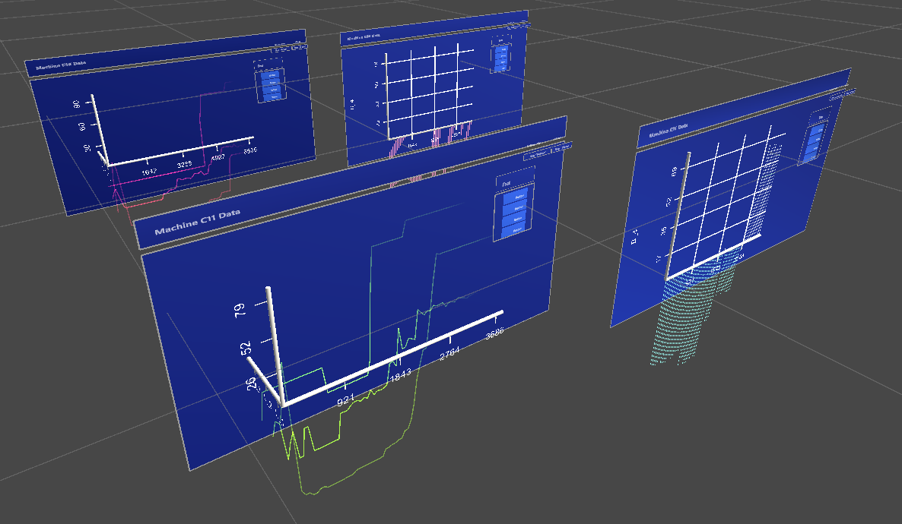

# Data Visualization with the HoloLens 2 

This project took place as part of the Digital Reality program's "Project 1" at HAW Hamburg.
It includes a prototype to visualize data in 3d plots and 3d space with the HoloLens 2.
The project is based on Unity 2020.3.22, MRTK2 and the [u2vis framework](https://github.com/imldresden/u2vis).

